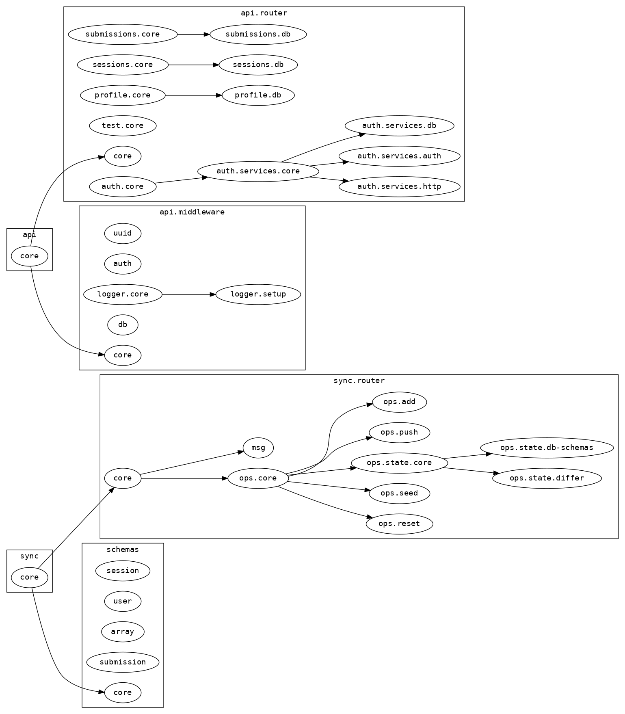
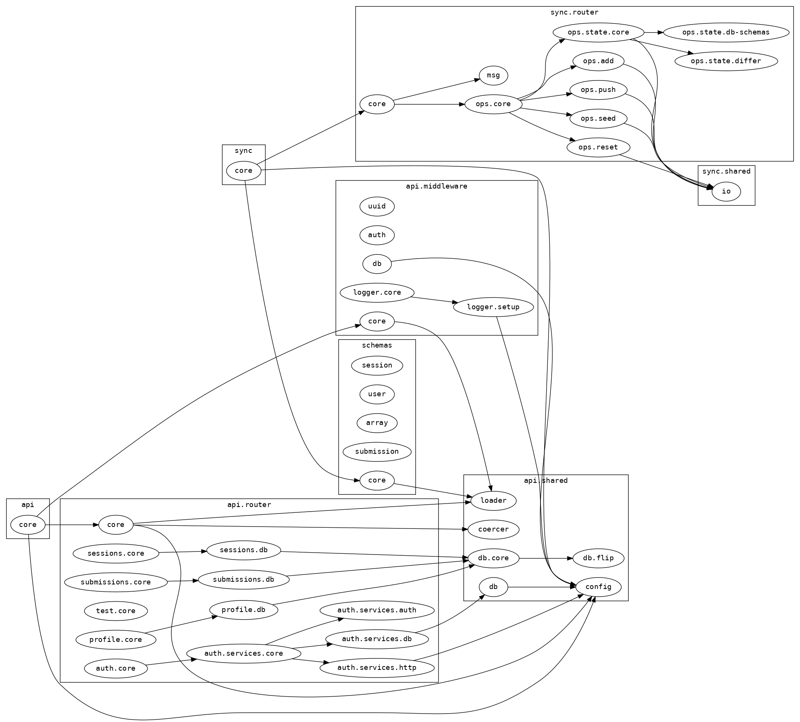

## clojure api

#### api dependency graph

#### api dependency graph (including shared ns)

#### setup githooks

    make setup-githooks    

#### run the api

    # start server
    lein ring server

#### run local datomic instance

    # start datomic
    make run-datomic

    # destroy datomic
    make destroy-datomic
